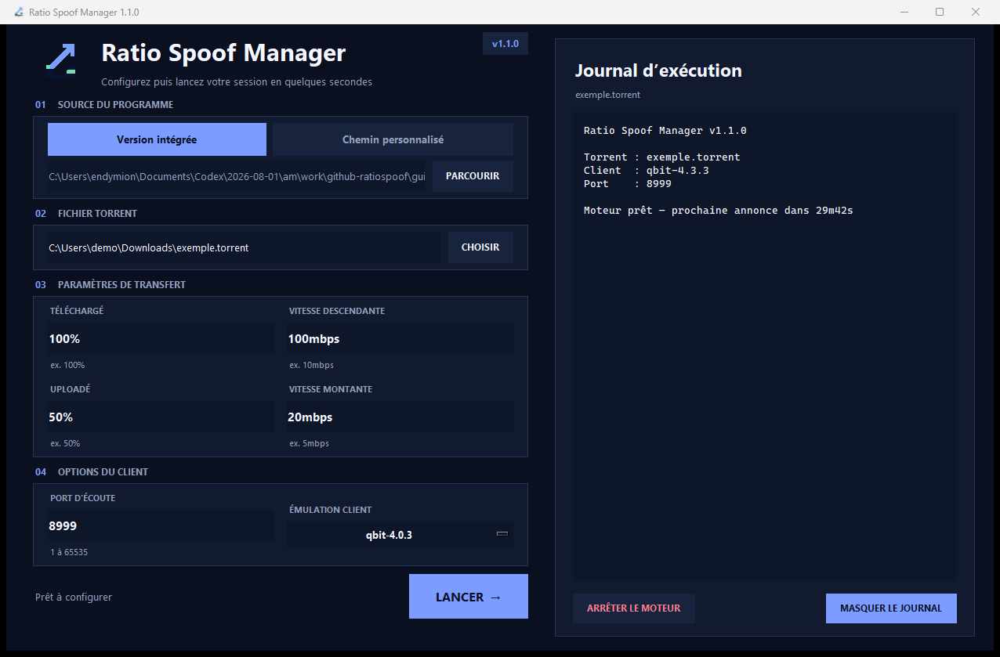

# ratio-spoof

[](https://github.com/Endymi0n74/ratio-spoof-gui/actions/workflows/ci.yml)
[](https://github.com/Endymi0n74/ratio-spoof-gui/releases/latest)
[](./LICENSE)

Ratio-spoof is a cross-platform, free and open source tool to spoof the download/upload amount on private bittorrent trackers.

## Windows GUI

This repository also includes **Ratio Spoof Manager**, a modern Windows interface for configuring and running the command-line engine.



Features:

- integrated execution log in the main window;
- torrent and executable file pickers;
- automatic validation and normalization of transfer values;
- bundled-engine or custom-engine mode;
- port and qBittorrent client-emulation controls;
- persistent local settings and safe process shutdown.

[Download the latest Windows release](https://github.com/Endymi0n74/ratio-spoof-gui/releases/latest)

The GUI source and reproducible Windows build script are available in [`gui/`](./gui/). The published executable is not digitally signed.

### Résumé en français

Ratio Spoof Manager fournit une interface Windows pour sélectionner un torrent, régler les valeurs de transfert, choisir le port et l’émulation client, puis suivre le moteur dans un journal intégré. Consultez [`gui/README.md`](./gui/README.md) pour les instructions françaises et anglaises.

> [!CAUTION]
> Use this software only where you are authorized to do so. Artificial tracker reporting can violate tracker rules and may result in account suspension. Prefer real seeding whenever possible.


## Motivation
Here in Brazil, not everybody has a great upload speed, and most private trackers require a ratio greater than or equal to 1. For example, if you downloaded 1GB, you must also upload 1GB in order to survive. Additionally, I have always been fascinated by the BitTorrent protocol. In fact, [I even made a BitTorrent web client to learn more about it](https://github.com/ap-pauloafonso/rwTorrent). So, if you have a bad internet connection, feel free to use this tool. Otherwise, please consider seeding the files with a real torrent client.

## How does it work?

Bittorrent protocol works in such a way that there is no way that a tracker knows how much certain peer have downloaded or uploaded, so the tracker depends on the peer itself telling the amounts.

Ratio-spoof acts like a normal bittorrent client but without downloading or uploading anything, in fact it just tricks the tracker pretending that.

## Usage
```
usage: 
	./ratio-spoof -t <TORRENT_PATH> -d <INITIAL_DOWNLOADED> -ds <DOWNLOAD_SPEED> -u <INITIAL_UPLOADED> -us <UPLOAD_SPEED> 

optional arguments:
	-h           		show this help message and exit
	-p [PORT]    		change the port number, default: 8999
	-c [CLIENT_CODE]	change the client emulation, default: qbit-4.0.3
	  
required arguments:
	-t  <TORRENT_PATH>     
	-d  <INITIAL_DOWNLOADED> 
	-ds <DOWNLOAD_SPEED>						  
	-u  <INITIAL_UPLOADED> 
	-us <UPLOAD_SPEED> 						  
	  
<INITIAL_DOWNLOADED> and <INITIAL_UPLOADED> must be in %, b, kb, mb, gb, tb
<DOWNLOAD_SPEED> and <UPLOAD_SPEED> must be in kbps, mbps
[CLIENT_CODE] options: qbit-4.0.3, qbit-4.3.3
```

```
./ratio-spoof -d 90% -ds 100kbps -u 0% -us 1024kbps -t (torrentfile_path) 
```
* Will start "downloading" with the initial value of 90% of the torrent total size at 100 kbps speed until it reaches 100% mark.
* Will start "uploading" with the initial value of 0% of the torrent total size at 1024kbps (aka 1mb/s) indefinitely.

```
./ratio-spoof -d 2gb -ds 500kbps -u 1gb -us 1024kbps -t (torrentfile_path) 
```
* Will start "downloading" with the initial value of 2gb downloaded  if possible at 500kbps speed until it reaches 100% mark.
* Will start "uploading" with the initial value of 1gb uplodead at 1024kbps (aka 1mb/s) indefinitely.

## Will I get caught using it ?
Depends on whether you use it carefully, It's a hard task to catch cheaters, but if you start uploading crazy amounts out of nowhere or seeding something with no active leecher on the swarm you may be in risk.

## Bittorrent client supported 
The default client emulation is qbittorrent v4.0.3, however you can change it by using the -c argument

## Resources
http://www.bittorrent.org/beps/bep_0003.html

https://wiki.theory.org/BitTorrentSpecification

